<p align="center">
  <a href="./README.md"><b>English</b></a> · <a href="./README.zh-CN.md">简体中文</a>
</p>

<p align="center">
  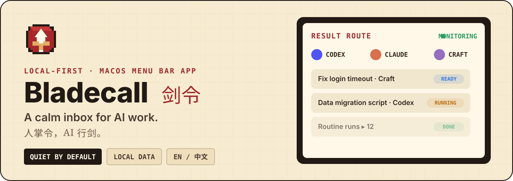
</p>

<p align="center">
  
  
  
  
</p>

**Bladecall** (剑令) is a local-first macOS menu bar app for people who run work across several AI coding tools at once. It watches task state, keeps routine and background work separate, and leaves a single quiet signal when a result is ready — so you do not have to keep checking every conversation.

> **You stay in command. AI does the work.** · 人掌令，AI 行剑。

<p align="center">
  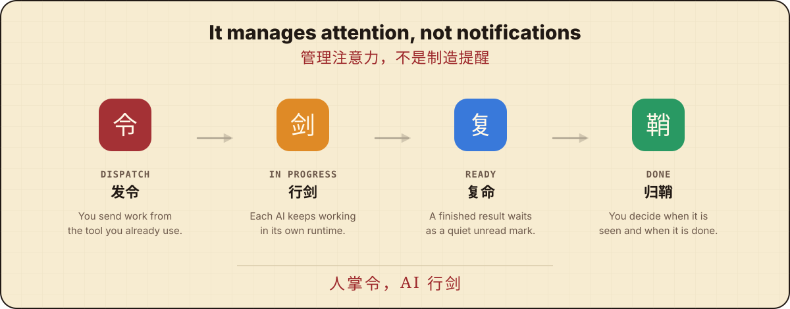
</p>

Most multi-agent workflows still make the human poll every window. Bladecall reverses that: each task walks **one clear loop** — you dispatch, the AI runs, the result returns as a quiet unread mark, and *you* decide when it has been reviewed and closed. The app does not pretend every local session is an important conversation. Scheduled work is separated from subagents and detached runtimes, and only tools with a reliable local event source are ever labelled "supported".

## What you get

- **One result inbox** for Codex, Claude Code, Craft Agents, NewMax, and WorkBuddy.
- **A clear lifecycle** — `In progress → Ready → Reviewed → Done` (行剑中 → 复命未阅 → 已阅待决 → 归鞘).
- **Routine runs** kept visible, because their output still matters.
- **Background runs** folded away for subagents and technical runtime noise.
- **Quiet by default** — no forced system notifications; sounds and motion are optional.
- **Quota at a glance** (剑气) for the windows Codex and Claude Code actually return — no account tokens stored.
- **Daily activity** (剑迹) with a zoomable timeline of app focus, task runs, completions, and handling time.
- **English and Chinese** across the app, reports, notifications, and the iPhone companion.

## Runtimes

**Monitored today** — a reliable local completion signal, actively watched:

<p align="center">
  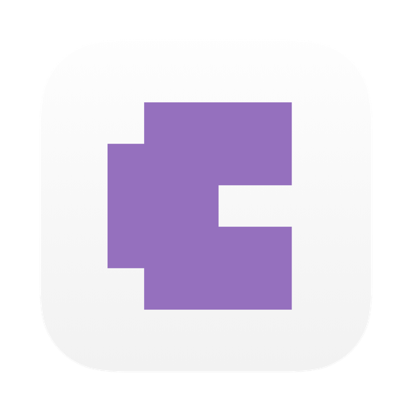&nbsp;&nbsp;&nbsp;&nbsp;
  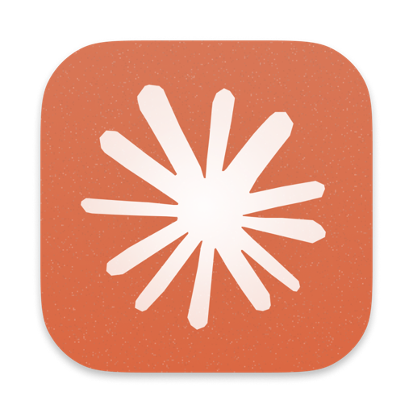&nbsp;&nbsp;&nbsp;&nbsp;
  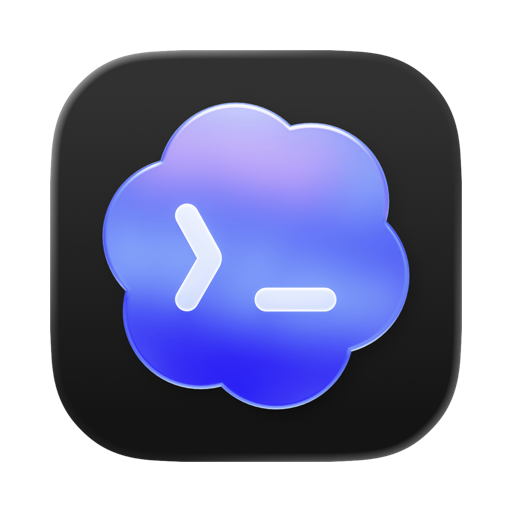&nbsp;&nbsp;&nbsp;&nbsp;
  &nbsp;&nbsp;&nbsp;&nbsp;
  
</p>
<p align="center">
  <sub><b>Craft Agents</b> · <b>Claude Code</b> · <b>Codex</b> · <b>NewMax</b> · <b>WorkBuddy</b></sub>
</p>

**Also recognized** — Bladecall shows these in the app too; some are detected on your Mac, others are on the roadmap. It does **not** yet claim reliable completion monitoring for them:

<p align="center">
  &nbsp;&nbsp;&nbsp;
  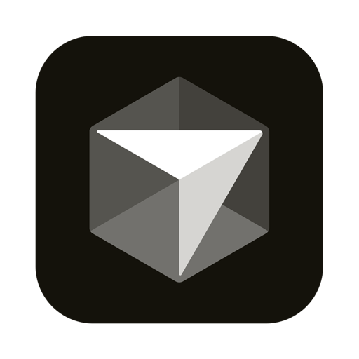&nbsp;&nbsp;&nbsp;
  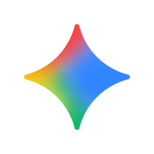&nbsp;&nbsp;&nbsp;
  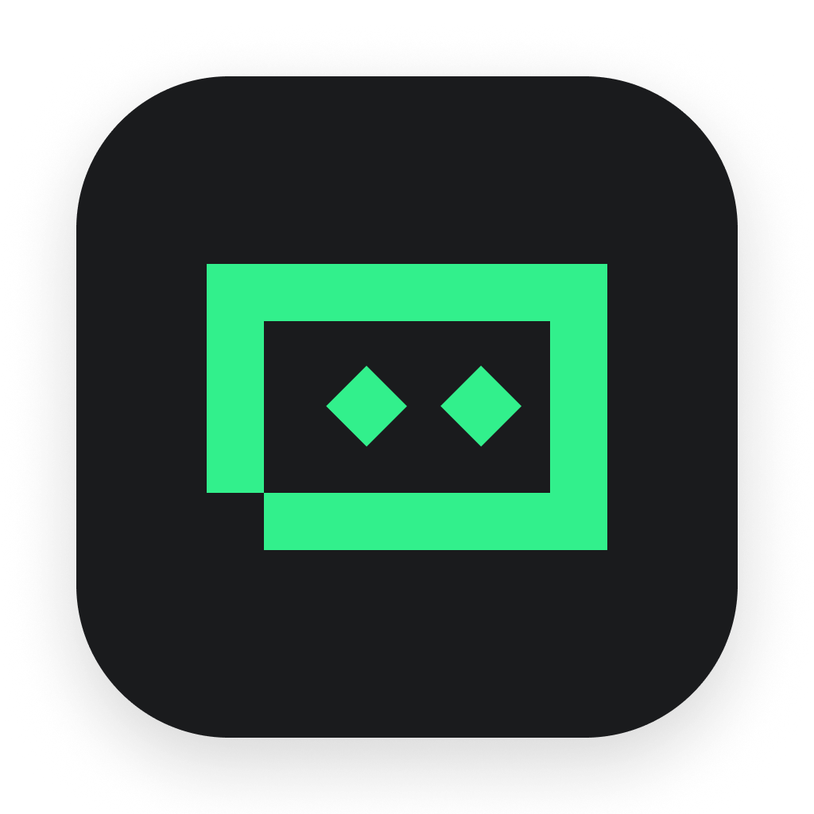&nbsp;&nbsp;&nbsp;
  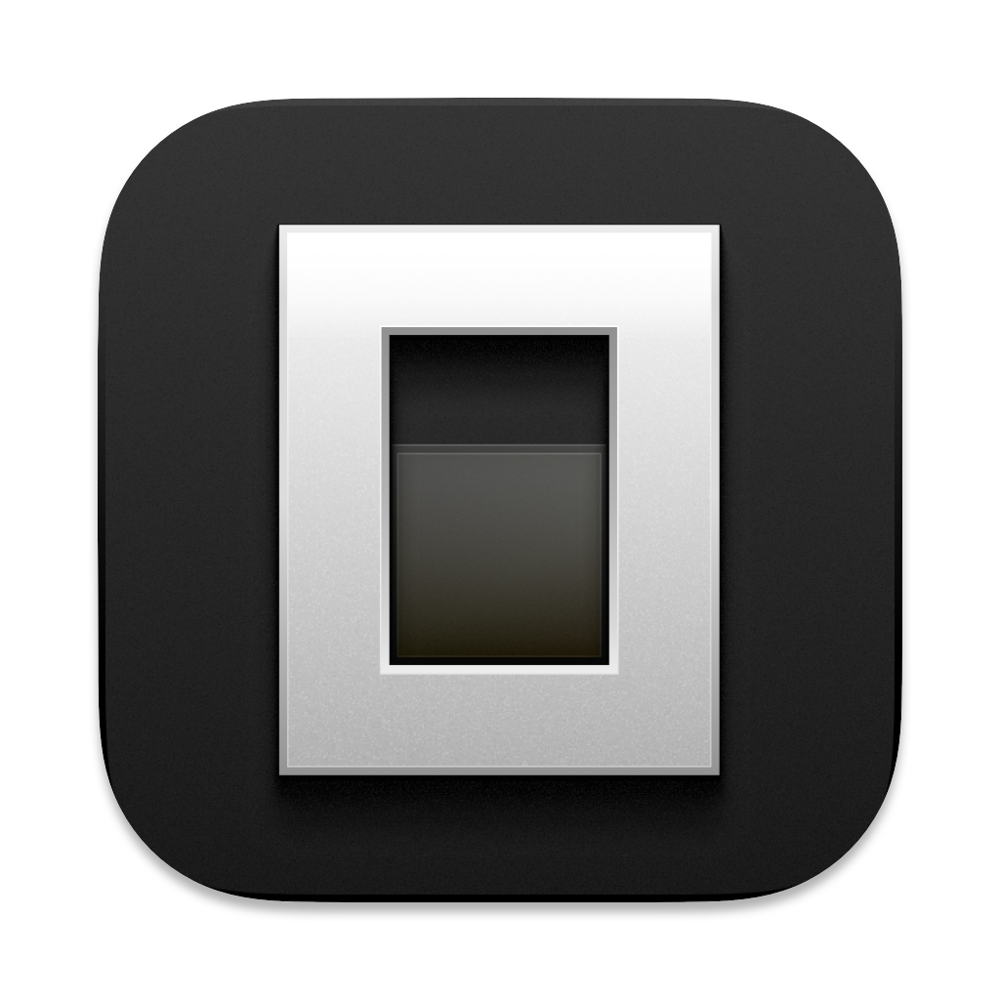&nbsp;&nbsp;&nbsp;
  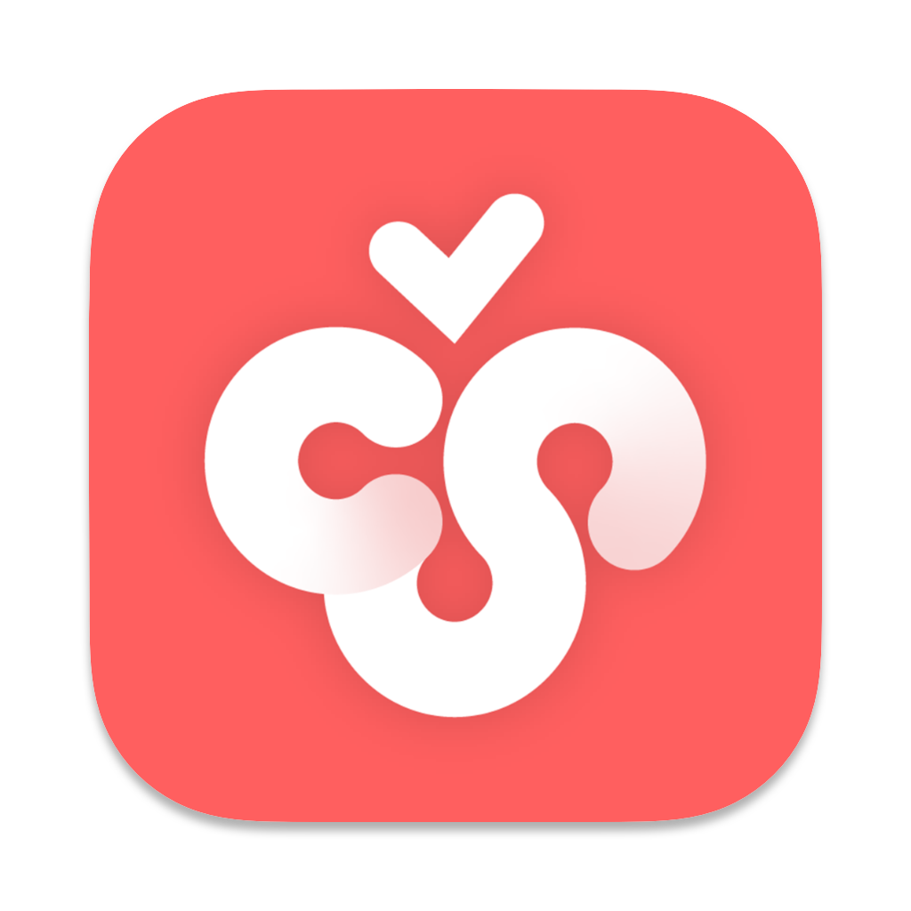&nbsp;&nbsp;&nbsp;
  &nbsp;&nbsp;&nbsp;
  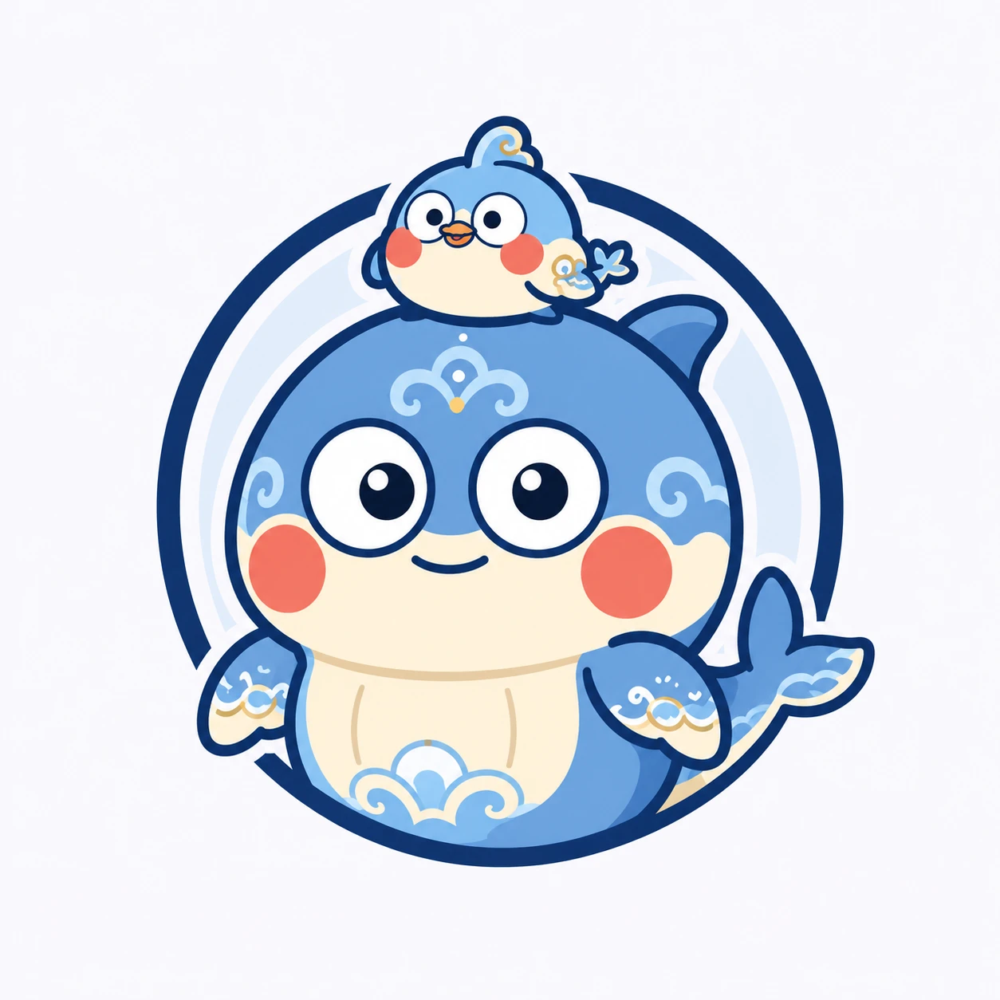&nbsp;&nbsp;&nbsp;
  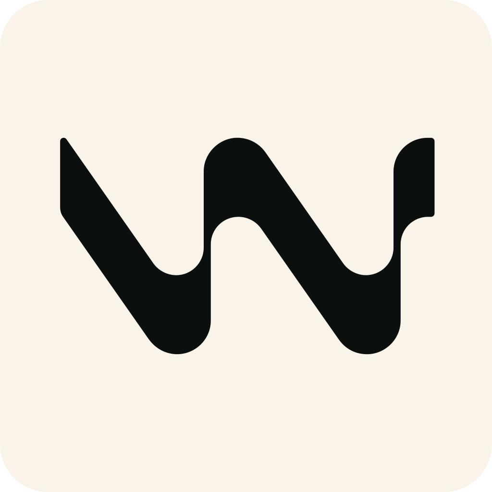&nbsp;&nbsp;&nbsp;
  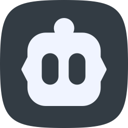&nbsp;&nbsp;&nbsp;
  &nbsp;&nbsp;&nbsp;
  &nbsp;&nbsp;&nbsp;
  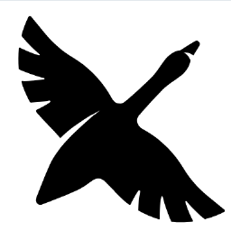&nbsp;&nbsp;&nbsp;
  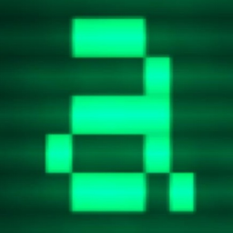
</p>
<p align="center">
  <sub>Hermes · Cursor · Gemini CLI · TRAE · OpenCode · Cherry Studio · Kimi · Kun · Windsurf · Cline · GitHub Copilot · Kiro · Goose · Aider</sub>
</p>

Bladecall never labels an app "monitored" until it has a reliable local event source — no screenshot scraping and no browser automation are used to infer completion.

<details>
<summary>How each completion signal is read</summary>

| Runtime | Completion signal |
| --- | --- |
| **Craft Agents** | The latest non-intermediate assistant event appears after the current user turn. |
| **Claude Code** | The latest assistant message ends with `stop_reason=end_turn`. |
| **Codex** | `event_msg.payload.type=task_complete`, deduplicated by `turn_id`. |
| **NewMax** | The latest assistant snapshot has a final result and no active tool call. |
| **WorkBuddy** | The latest assistant message for the turn has `status=completed`. |

</details>

## How monitoring works

Bladecall uses FSEvents to watch the local session directories of supported tools. Changes are debounced, only the affected adapter is rescanned, and a low-frequency reconciliation pass catches missed filesystem events. If FSEvents is unavailable, monitoring falls back to polling.

```text
local session events
        ↓
runtime adapters  →  task-state reconciliation
        ↓
quiet inbox  +  daily activity  +  optional device sync
```

<p align="center">
  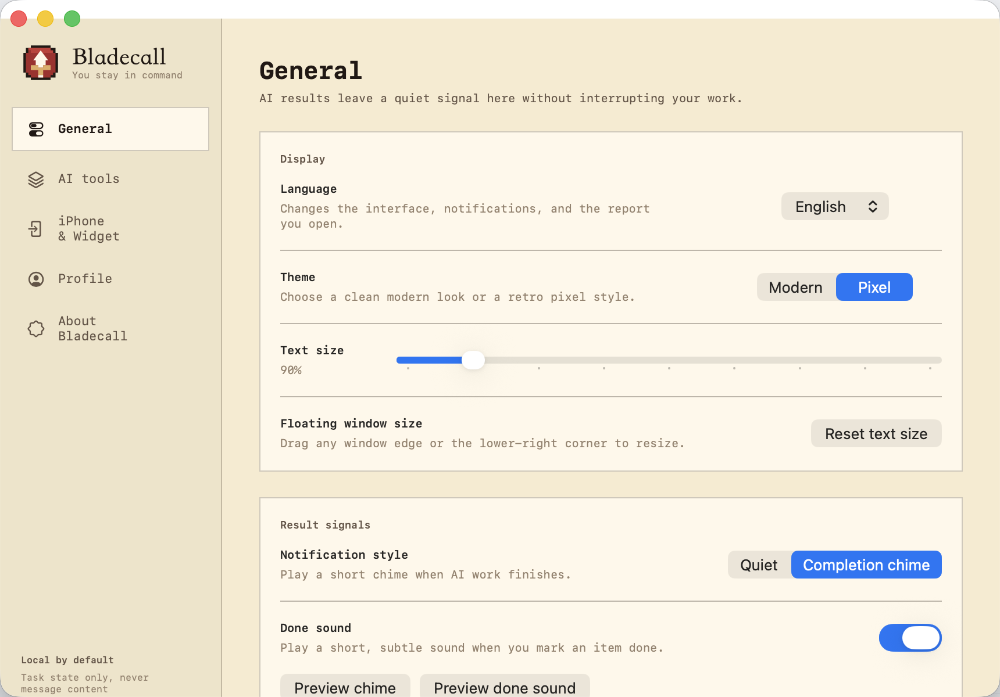
</p>

## Build and run

**Requirements:** macOS 13 Ventura or newer · Swift 6 toolchain

```bash
git clone https://github.com/PemZhipengXie/Bladecall.git
cd Bladecall
./scripts/verify-mvp.sh      # tests + simulate + doctor + packaging checks
./scripts/install-local.sh   # installs to ~/Applications and registers a LaunchAgent
```

Remove it any time with `./scripts/uninstall-local.sh`.

## Privacy boundaries

- Activity data stays on your devices by default; nothing is uploaded.
- Bladecall does **not** store, display, or upload conversation message bodies.
- Reports contain only timestamps, runtime names, task titles, project names, origins, and state transitions.
- Quota (剑气) reads remaining allowance and reset time from existing local sign-ins; it never stores account tokens.
- A task row activates its host app; a specific conversation is deep-linked only when the runtime exposes a stable route.
- Web-only conversations without a reliable local event source are never presented as monitorable.

## iPhone companion

The iPhone companion and Widget live in a separate private repository and are planned as a proprietary App Store product at a small one-time price (target **US$0.99** or the regional equivalent; final prices are set in App Store Connect). The macOS app is fully useful on its own — the mobile app is an optional way to review and handle returned results away from the Mac.

## License

Bladecall is **source-available**, not open source, because commercial use is restricted:

- **macOS app and reusable core** — [PolyForm Noncommercial License 1.0.0](https://polyformproject.org/licenses/noncommercial/1.0.0/). Inspect, modify, and use for personal and other noncommercial purposes. Commercial use requires a separate written license.
- **iPhone app and widgets** — proprietary, distributed through the App Store, source kept separately.
- **Bladecall / 剑令 names, logo, sounds, and brand assets** — all rights reserved; the software license does not grant branding rights.

See [LICENSING.md](./LICENSING.md) for the full split.

## Current limits

- Runtime file formats are not public APIs and may change between tool releases.
- Host-window visibility is not equally precise across all runtimes.
- A completed result is detected reliably without knowing which exact conversation you are currently reading.

## Contributing

Bug reports, adapter research, reproducible fixtures, accessibility improvements, and privacy-focused performance work are welcome. Please do **not** submit message bodies, credentials, or private session files in issues.

---

<p align="center"><b>Send the work out. Bring the results home.</b><br><sub>任务发出去，结果回来找你。</sub></p>
